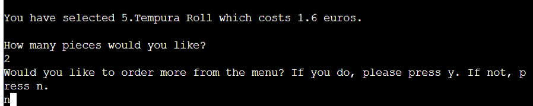
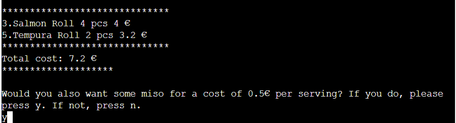
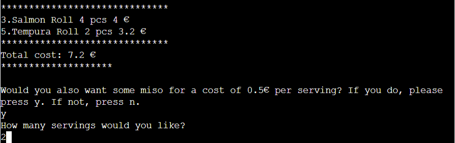
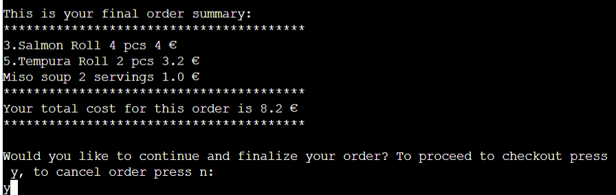
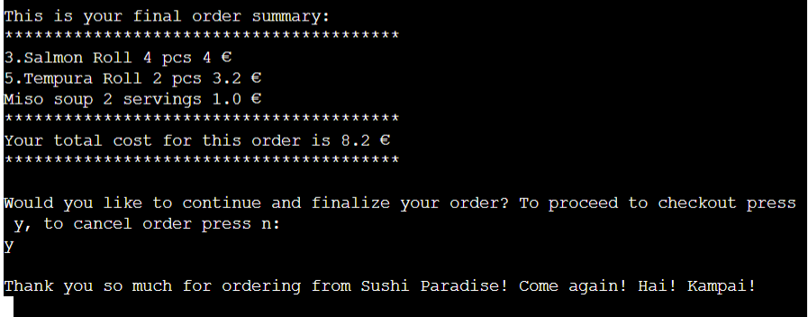

# Sushi Order System

welcome all sushi lovers. Here I have created an order program where the user can order sushi and miso. The user can navigate through the order by using predetermined numbers and letters provided by the program.

[Sushi Order System](https://sushi-order-system-a713e9a7b19b.herokuapp.com/)

## Navigation
- [Goals](#goals)
- [Flow Chart](#flow-chart)
- [Features](#features)
- [Future feature left to implement](#future-feature-left-to-implement)
- [Technologies Used](#technologies-used)
- [Testing and Validation](#testing-and-validation)
- [Deployment](#deployment)
- [Credits](#credits)
- [Acknowledgements](#acknowledgements)
## Goals

### User goal
  - The goal of this system is to give the user the opportunity to order sushi at the touch of a button to bring home amazing food without talking to anyone.

### Website owners goals
  - Offer a simple order system.
  Give information to the user what the next step is and explain how to proceed to a full order.

## Flow Chart

To create the structure of the order system, this diagram was created using Lucid Charts.

## Features

### Order

- You are now welcomed to the front page and here you have the opportunity to start your order. 
Follow along as I take you through all the steps to complete an order.

1. Here the user now gets 5 choices of different variations of sushi, where you press a desired number that stands in front of each sushi dish.

2. Now you choose a number and then press enter. 

3. Now you have chosen a sushi dish and now you have to choose how many pieces there should be and press enter. The chosen amount is now in your cart and the system will ask you if you want to order some more ( y=yes, n=no). We will press y.

4. It goes without saying that you cannot have too much sushi, at this stage you may now choose a new type of sushi. push on the right number you want then press enter. Now the the system will ask you if you want to order some more and we will press no.

5. When you press n, your sushi cart will be displayed with the cost you are up to. Now you will also be asked if you want some miso with your sushi. We will press y.

6. Now we can choose how many servings we want and then press enter.

7. In this step, your order summary will appear with the number of sushi and miso dishes. Here you can now proceed to checkout. We will press yes.

8. When we press y, a thank you text appears that reads: Thank you for ordering from Sushi Paradise! Come again! Hai! Campaign!

## Future feature left to implement

 - Drinks ordering
 - Ingredients on a separate page when choosing dishes
 
 ## Technologies Used
 
- Python
- GitHub
- Gitpod
- Heroku
- LucidChart

## Testing and Validation

### PEP8
- The code was checked with PEP8 validator and passed with no error found.
- All features have been tested manually with different kind of laptops.

### Unfixed Bugs
- None that I'm aware of at the moment.

## Deployment

 There is only this main branch of the project version available in GitHub. This version is also deployed live on Heroku.

### How to deploy
- To deploy this page to Heroku from its GitHub repository the following steps were taken:

- Log into or register a new account at Heroku.

- Click on the button New in the top right corner of the dashboard.

- From the drop-down menu then select Create new app.

- Enter your app name in the first field, the names must be unique so check that then name you have chosen is available on Heroku, then select your region.

- Click on Create App.

- Once the app is created you will see the Overview panel of the application. Now move to the Settings tab.

- Scroll down to Buildpacks. Click the button Add buildpack and select 'python'. Do the same step and add 'node.js'. PYTHON MUST BE ON TOP OF THE BUILDPACKS. if in your case node.js is first, click and drag Python to top and save.

- Return back to the Deploy tab. From the deployment method, select 'Github' as the deployment.

- You will be asked to connect your github account. Confirm and proceed.

- Search for your repository name and connect.

- Once that is done and successfully connected, select how you want to push updates from the following options.

- Clicking Enable Automatic Deploys. This will update once you push updates to your Github.

- Selecting the correct branch for deployment from drop-down menu and pressing Deploy Branch button. This will have to be done everytime manually.

## Credits

- Credit to scb at stack overflow for ideas in the project.
- My dear friend Kristofer Gabrielsson for inputs and problemsolving.
- Code Institute, Love sandwiches.
- alessandracosta8 at GitHub for readme ideas.
## Acknowledgements

The site was completed as a Portfolio 3 Project for the Full Stack Software Developer (e-Commerce) Diploma at the Code Institute.
- I would like to thank Cohort Facilitator Alan Bushell, at Code Institute for the support and never doubt me.
- My friend Kristofer Gabrielsson, you are the best!
