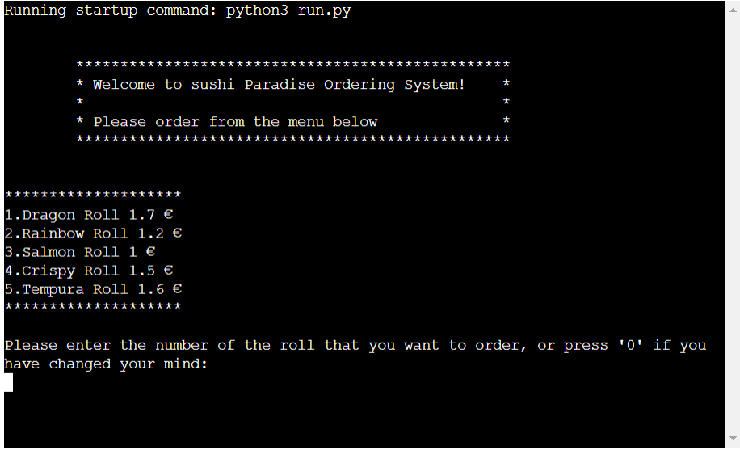
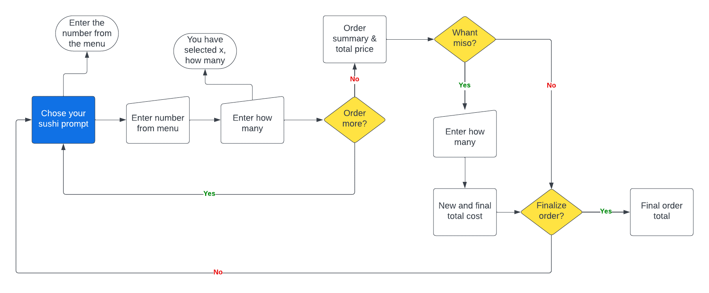
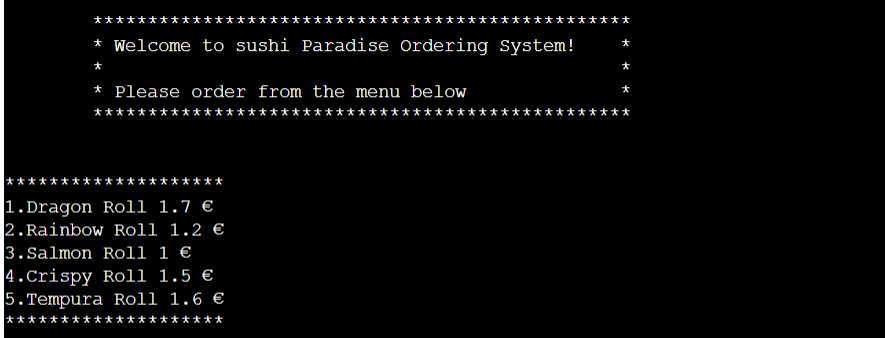
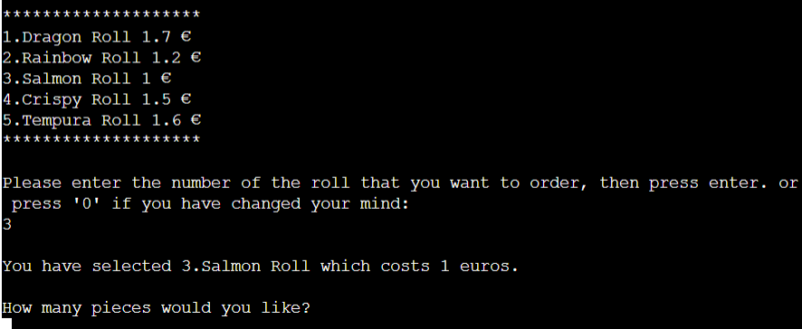
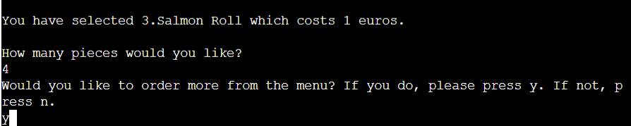

# Sushi Order System

welcome all sushi lovers. Here I have created an order program where the user can order sushi and miso. The user can navigate through the order by using predetermined numbers and letters provided by the program.

[Sushi Order System](https://sushi-order-system-a713e9a7b19b.herokuapp.com/)

## Navigation
--- 
## Goals
---
### User goal
  - The goal of this system is to give the user the opportunity to order sushi at the touch of a button to bring home amazing food without talking to anyone.
### Website owners goals
  - Offer a simple order system.
  Give information to the user what the next step is and explain how to proceed to a full order.
## Flow Chart
---
To create the structure of the order system, this diagram was created using Lucid Charts.

## Features
---
### Order

- You are now welcomed to the front page and here you have the opportunity to start your order. 
Follow along as I take you through all the steps to complete an order.

1. Here the user now gets 5 choices of different variations of sushi, where you press a desired number that stands in front of each sushi dish.

2. Now you choose a number and then press enter. 

3. Now you have chosen a suchi dish and now you have to choose how many pieces there should be.

